# Metabolism across brain cell types, disease and the *C4b*⁺ oligodendrocyte state

OligoMetab project · in-house Xenium / Visium / Falcão data plus sixteen public datasets · {{DATE}}

**The question.** Do for metabolism (ketone bodies, glycolysis and lactate, mitochondrial oxidation, fatty acids, lipids and their regulators) what OligoC4b did for complement: which cell types run which pathway, how that changes with disease, age, demyelination and lesion distance in every annotated cell type, and how it relates to the *C4b*⁺ disease-associated oligodendrocyte state.

**The short answer.** Metabolic identity of the cell types is stable across platforms and species. Neuroinflammation (EAE) shifts the whole tissue, not one cell type: cholesterol synthesis and the TCA cycle fall and lipid uptake and storage rise in nearly every cell type, steepest near lesions, where OPCs and newly formed oligodendrocytes lose cholesterol synthesis most. The disease-associated oligodendrocyte state, both in situ (Xenium, 107 samples) and in sorted single cells (Falcão), is less cholesterol and myelin-lipid synthesis, more lipid uptake and storage (*Plin2* / *Plin4*, *Abca1*, *Lpl*, *Cd36*), a *Hk2* / *Pdk4* / *Ldha* glycolytic-switch signature, *Bdh1* induction and less MCT1 (*Slc16a1*). In human MS oligodendrocytes cholesterol synthesis is, if anything, higher, and the hypoxia / nutrient-stress genes *Hif1a*, *Txnip* and *Ddit4* are up. Across all mouse datasets the one metabolic feature that travels with *C4b* is lipid handling (*Apod*, *Plin4*, *Abca1*), not energy metabolism and not ketone bodies: the ketone enzymes belong to astrocytes and OPCs, the ketone receptor *Hcar2* to microglia, and *Hcar2*⁺ and lactate-exporting *Slc16a3*⁺ cells are enriched around *C4b*-high oligodendrocytes in EAE as C5aR1⁺ cells were in OligoC4b.

## 1. Data and gene panel

Datasets are those of OligoC4b: Xenium mouse AD (347-gene panel, one section per genotype × age), Xenium mouse EAE (5K panel, 107 samples, lesion-distance annotation), Visium aging mouse brain (6 sections), Falcão et al. 2018 EAE scRNA-seq (sorted oligodendrocyte-lineage cells, microglia, VLMC) and sixteen public whole-transcriptome datasets (mouse AD, aging, demyelination, spatial AD; human AD and MS single-nucleus and Visium). The gene panel has 183 mouse genes in 21 pathway groups (ketone-body synthesis and utilisation, ketone / SCFA receptors, monocarboxylate and glucose transporters, glycolysis, pyruvate fate, pentose phosphate, glycogen, TCA, anaplerosis, OXPHOS, mitochondrial biogenesis, fatty-acid uptake and β-oxidation, lipid, cholesterol and myelin-lipid synthesis, cholesterol / lipid transport and storage, nutrient-sensing regulators). Pathway *scores* are `scanpy.tl.score_genes` values (set mean minus a size-matched control set, log scale) and are compared by difference; single genes by log2 fold change of pseudobulk means; groups by Mann–Whitney across samples when both have ≥3 samples.

| Platform | Panel genes present |
| --- | --- |
| Xenium mouse AD | 3 of 183 (*Apoe*, *Apod*, *Acsbg1*): metabolism is not measurable |
| Xenium mouse EAE (5K) | 100 of 183; no ketogenesis / ketolysis enzymes, 2 of 15 OXPHOS, 3 of 12 cholesterol-synthesis genes |
| Visium, Falcão, public | 177–183 of 183; metabolic genes are quantifiable in human data, unlike *C4A*/*C4B* |

## 2. Division of labour between cell types

Astrocytes and neurons carry the highest glycolysis, TCA and OXPHOS scores; homeostatic oligodendrocytes the highest lipid-synthesis and newly formed oligodendrocytes the highest cholesterol-synthesis score; microglia, macrophages and foamy myeloid cells the highest lipid-transport / storage score with the lowest cholesterol synthesis. In sorted cells OPC / COP / NFOL have the highest ketone-utilisation and TCA scores of the lineage. The same profile holds across the seven public mouse single-cell datasets. *Hcar2* is microglial everywhere; *Slc16a1* (MCT1) is in 39 % of EAE oligodendrocytes in situ and 29–57 % of whole oligodendrocytes in droplet data.

<figure markdown="1">
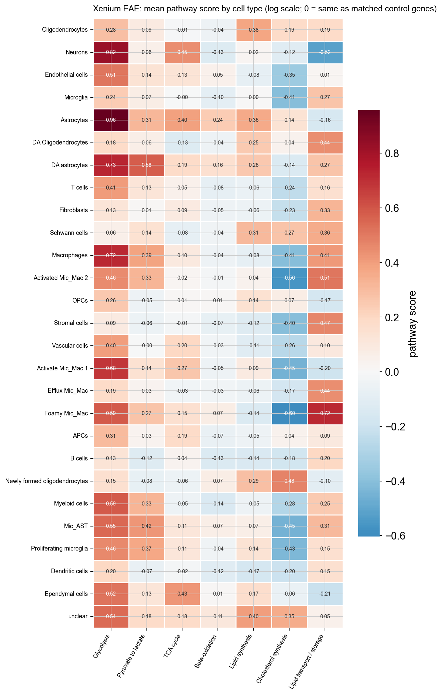
<figcaption>Xenium EAE: mean pathway score by cell type (27 types). Scores are relative to size-matched control genes; 0 means no enrichment.</figcaption>
</figure>

<figure markdown="1">
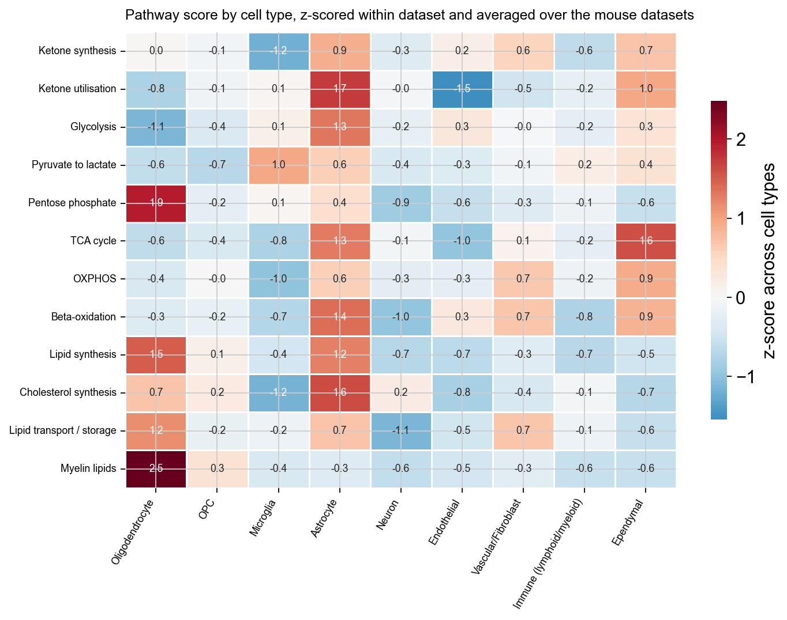
<figcaption>Public mouse datasets: pathway score by coarse cell type, z-scored within each dataset and averaged.</figcaption>
</figure>

## 3. EAE is a tissue-wide metabolic shift

Comparing 92 EAE with 15 control samples per cell type, cholesterol synthesis falls and lipid transport / storage rises in essentially every cell type with enough control samples, and the TCA score falls in most; glycolysis rises only in microglia and DA oligodendrocytes. Gene-level, *Hcar2*, *Cd36*, *Hk2*, *Plin2*, *Plin4*, *Abca1*, *Lpl*, *Slc16a3* and *Txnip* rise across many cell types. Toward lesions, glycolysis and TCA fall in neurons, oligodendrocytes, endothelial and vascular cells, lipid storage rises almost everywhere, and cholesterol synthesis falls most in OPCs (−0.33), newly formed oligodendrocytes (−0.29) and DA oligodendrocytes (−0.16).

<figure markdown="1">
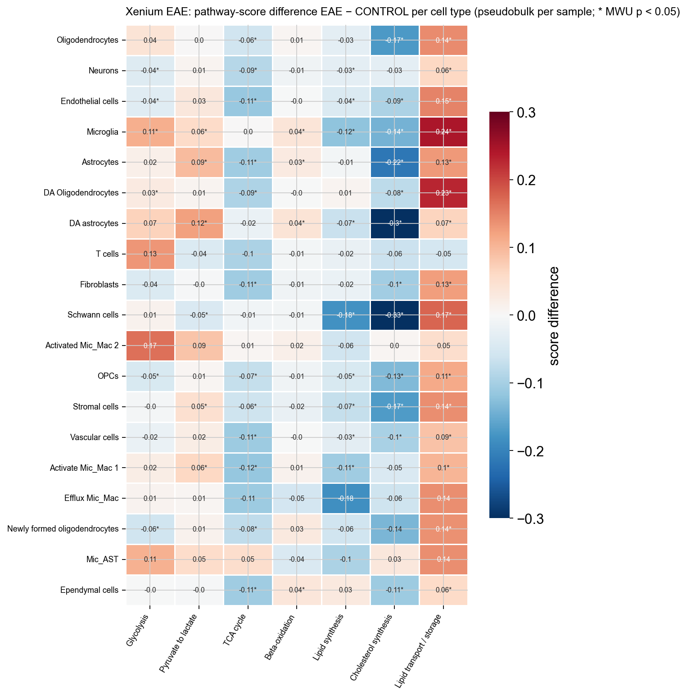
<figcaption>Xenium EAE: pathway-score difference EAE − CONTROL per cell type, pseudobulk per sample; * Mann–Whitney p < 0.05.</figcaption>
</figure>

<figure markdown="1">
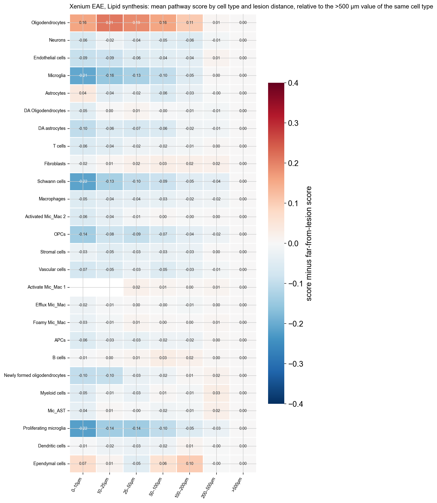
<figcaption>Xenium EAE: cholesterol-synthesis score by cell type and lesion distance, relative to each cell type's value beyond 500 µm.</figcaption>
</figure>

## 4. The disease-associated oligodendrocyte state

Within each of 107 samples, DA oligodendrocytes score lower than homeostatic ones on glycolysis (−0.10), TCA (−0.12), lipid synthesis (−0.15) and cholesterol synthesis (−0.16) and higher on lipid transport / storage (+0.15; 99 % of samples). Genes up: *Hk2* (3.5×), *Mlxipl*, *Hcar2*, *Cd36*, *Lpl*, *Slc16a3*, *Slc2a4*, *Txnip*, *Fabp7*, *Plin2*, *Abca1*, *Ldha*, *Pdk1*; down: *Slc2a3*, *Eno2*, *Ppargc1a*, *Got2*, *Mpc2*, *Pcx*, *Fh1*, *Ogdh*, *Mfn2*, *Dnm1l*, *Elovl1*, *Pfkp*. Sorted cells (Falcão, EAE-MOL vs control-MOL) confirm the core intrinsically: cholesterol synthesis −1.0 (*Hmgcs1*, *Fdps*, *Cyp51*, *Dhcr7*, *Dhcr24*, *Sqle* each 20–30 % lower), myelin-lipid synthesis −0.30, lipid transport / storage +0.95 (*Plin4* 5×, *Plin2* 3×, *Abca1* 2.5×), *Pdk4* 4×, *Ldha* 2.2×, *Cpt1a* 2.5×, *Bdh1* 2.3×, *Slc16a1* −0.24 log2. The direction of the glycolysis / TCA *scores* differs between the two datasets (down in situ, up in sorted cells) because the 15-gene Xenium set is weighted toward *Eno2*, *Pfkp* and *Slc2a3*, which fall, and the whole-transcriptome set toward *Aldoa*, *Tpi1*, *Gapdh* and *Ldha*, which rise; the gene tables are the safer read-out.

<figure markdown="1">
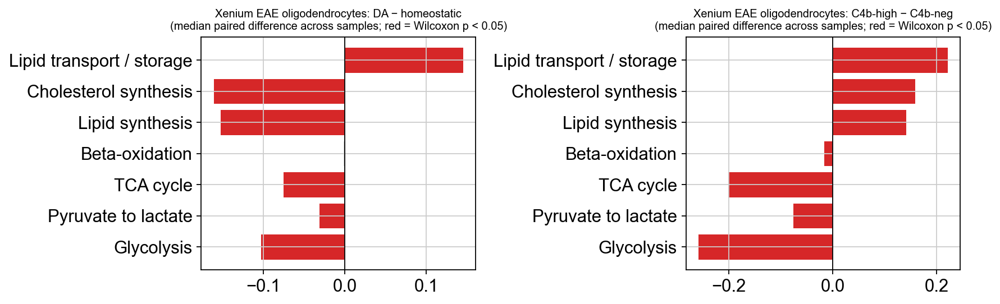
<figcaption>Xenium EAE: median paired difference in pathway score between DA and homeostatic oligodendrocytes (left) and between *C4b*-high and *C4b*-negative lineage cells (right) across samples; red = Wilcoxon p < 0.05.</figcaption>
</figure>

<figure markdown="1">
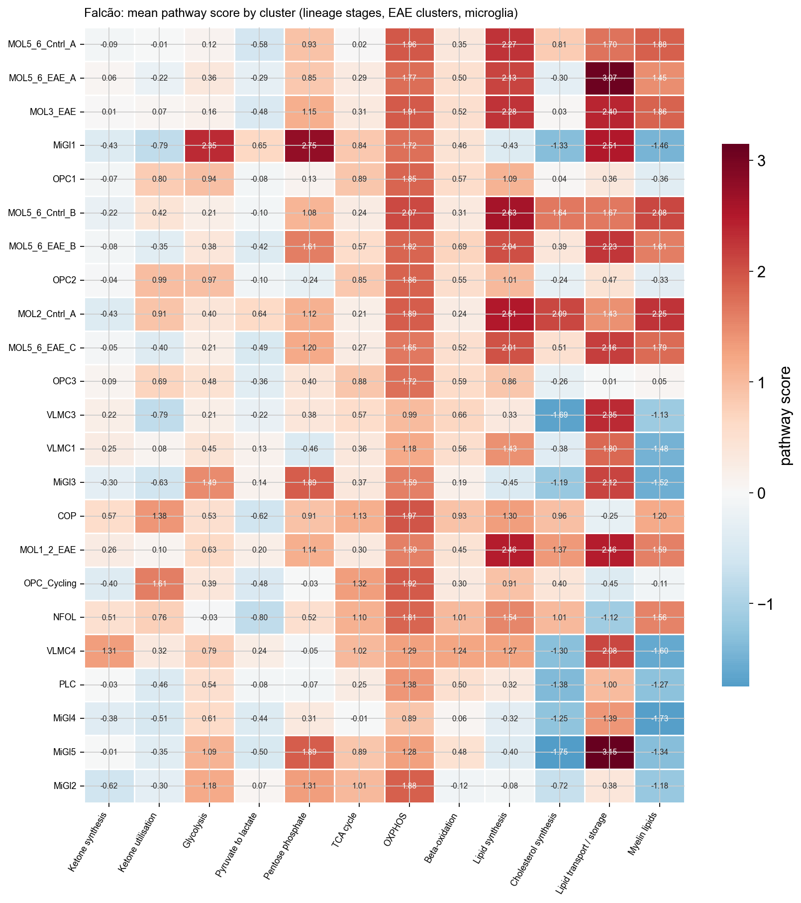
<figcaption>Falcão 2018 sorted cells: mean pathway score by cluster (OPC → COP → NFOL → MOL, EAE-MOL clusters, microglia, VLMC).</figcaption>
</figure>

## 5. Public datasets: small pathway shifts, consistent genes

Pathway-score differences in public oligodendrocytes are mostly within ±0.05. Clear ones: Schirmer MS oligodendrocytes more glycolytic (+0.16) and oxidative (+0.11) with more lipid storage; aged oligodendrocytes (Ximerakis) less OXPHOS, cholesterol and myelin-lipid synthesis; slightly lower ketone synthesis / utilisation in MS oligodendrocytes in three human sets; less lipid synthesis at Braak 6. At the gene level the same genes move in most of the 14 oligodendrocyte contrasts: *Lpl* and *Hk2* up in 10, *Apoe* / *Plin2* / *Fabp5* up in 6–7, *Slc16a1* down in 5, *Gal3st1* in 6, *Acsl6*, *Ppara*, *Lss*, *Srebf1*, *Cpt1c*, *Scd1* in 4–5. Microglia show the most reproducible signature of all: *Lpl* up in 12 of 13 contrasts (median log2FC 2.8), *Apoe* and *Plin2* in 8, *Pparg* and *Cd36* in 6–8, *Hcar2* in 6 of 10. Astrocytes gain *Cd36* and *Fabp7* and lose ketone utilisation in every MS dataset. Human MS oligodendrocytes have modestly higher cholesterol-synthesis scores than controls and more *Hif1a*, *Txnip* and *Ddit4*.

<figure markdown="1">
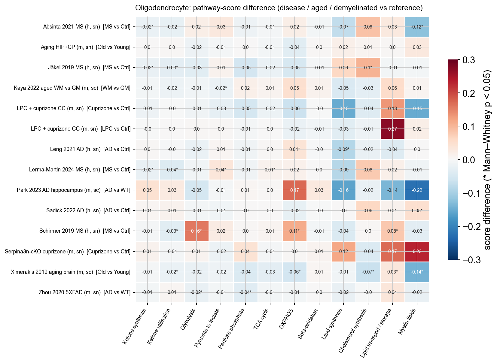
<figcaption>Public datasets, oligodendrocytes: pathway-score difference per contrast (disease / aged / demyelinated vs reference); * Mann–Whitney p < 0.05 across samples.</figcaption>
</figure>

<figure markdown="1">
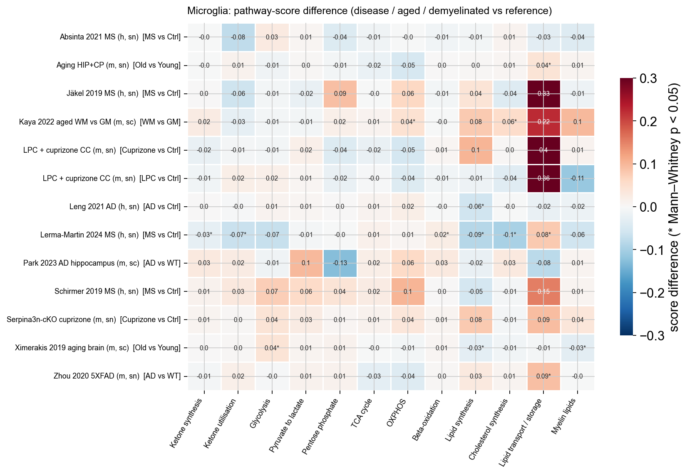
<figcaption>Public datasets, microglia: the same. Lipid transport / storage rises in nearly every disease contrast.</figcaption>
</figure>

<figure markdown="1">
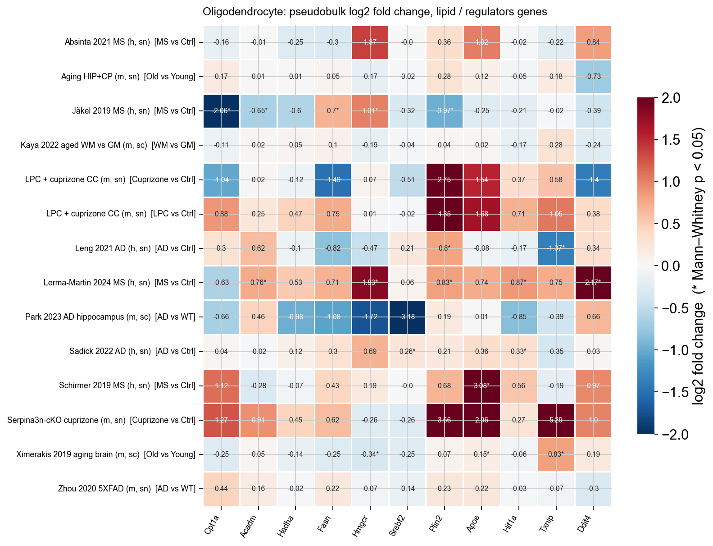
<figcaption>Public datasets, oligodendrocytes: pseudobulk log2 fold change of the lipid / regulator focus genes.</figcaption>
</figure>

## 6. The *C4b* axis

Inside DA oligodendrocytes (Xenium EAE) the metabolic genes that track *C4b* are lipid-droplet / lipid-handling genes (*Plin4* rank 2 of 3,673 panel genes, *Apod* 42, *Cers2* 72, *Fasn* 86); no metabolic pathway is enriched as a set, and across the lineage glycolysis, TCA and mitochondrial-biogenesis genes are anti-correlated with *C4b*. In sorted MOL lipid transport / storage is the top pathway (*Apod* ρ 0.46, *Plin4* 0.40, *Abca1* 0.32) and cholesterol synthesis is significantly anti-correlated. In the public mouse datasets the correlations are weak (|mean rho| < 0.1), *Apod* recurs among the top ranks (8–42), lipid transport / storage is the enriched pathway in LPC / cuprizone, *Serpina3n*-cKO and 5XFAD, and *C4b*-high oligodendrocytes have a higher lipid-storage score in all seven datasets. Ketone-body genes are not part of the program.

<figure markdown="1">
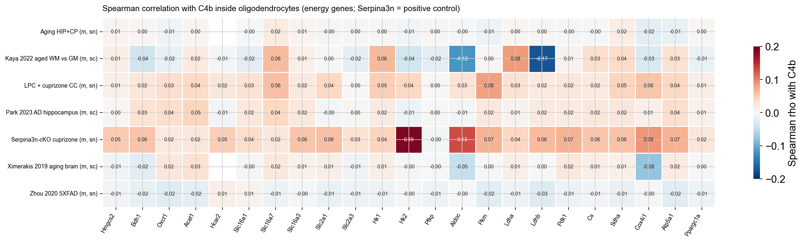
<figcaption>Public mouse datasets: mean Spearman correlation with *C4b* of each pathway's genes inside oligodendrocytes; * Mann–Whitney vs all other genes p < 0.05.</figcaption>
</figure>

<figure markdown="1">
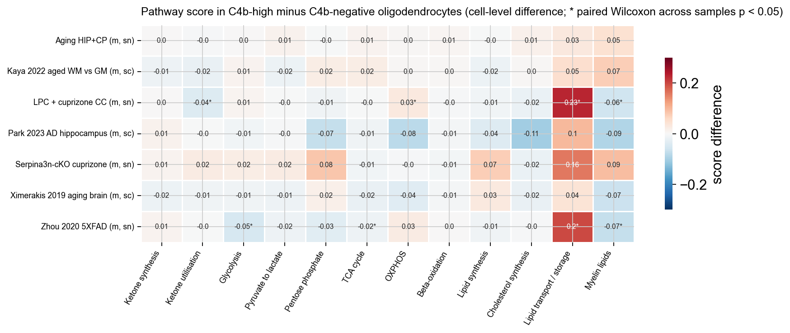
<figcaption>Public mouse datasets: pathway score in *C4b*-high minus *C4b*-negative oligodendrocytes; * paired Wilcoxon across samples p < 0.05.</figcaption>
</figure>

## 6b. Ketone-body metabolism, gene by gene

Brain ketogenesis is vascular and marginally astrocytic: *Hmgcs2* is detected in 3 % of astrocytes, 0 % of oligodendrocytes, microglia and human nuclei, and 12–22 % of endothelial cells; *Hmgcs2*⁺ astrocytes are the fatty-acid-oxidising ones (1.5–3.8× enriched for *Acadm*, *Cpt1a*, *Hmgcl*). The committed ketolytic enzyme *Oxct1* is broad, but the complete *Oxct1* + *Bdh1* machinery is a neuronal, ependymal and progenitor feature (45 % of OPC / COP / NFOL, 2 % of oligodendrocytes, < 1 % of microglia). MCT1 is endothelial and oligodendroglial, MCT2 neuronal, MCT4 microglial and, in EAE, astrocytic; *Hcar2* is strictly myeloid; *Ffar3* and SMCT1 are absent. In disease, *Bdh1* falls in oligodendrocytes across the public contrasts and rises in EAE oligodendrocytes (2.3× in sorted EAE MOL), *Acss1* / *Acss2* and *Ppara* fall broadly, MCT1 falls and MCT4 rises in disease oligodendrocytes, and *Hcar2* rises in disease microglia (+1.3 log2 aged, +2.6 in 5XFAD). No ketone gene correlates with *C4b* inside oligodendrocytes beyond |ρ| ≈ 0.1.

<figure markdown="1">
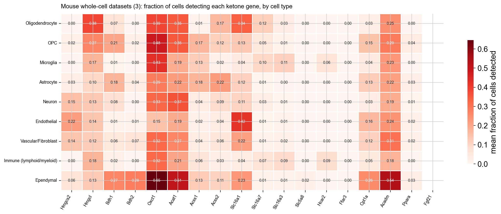
<figcaption>Mouse whole-cell datasets: fraction of cells detecting each ketone-related gene, by cell type (averaged over datasets).</figcaption>
</figure>

<figure markdown="1">
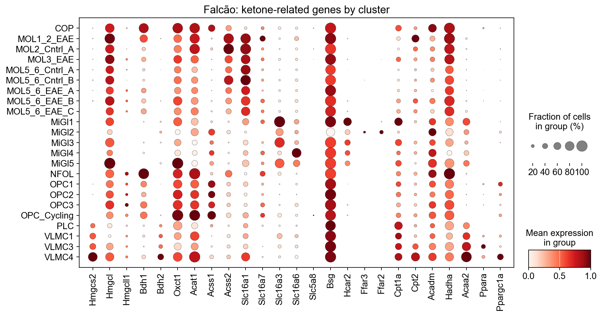
<figcaption>Falcão 2018 sorted cells: ketone-related genes by cluster along the oligodendrocyte lineage and in microglia.</figcaption>
</figure>

<figure markdown="1">
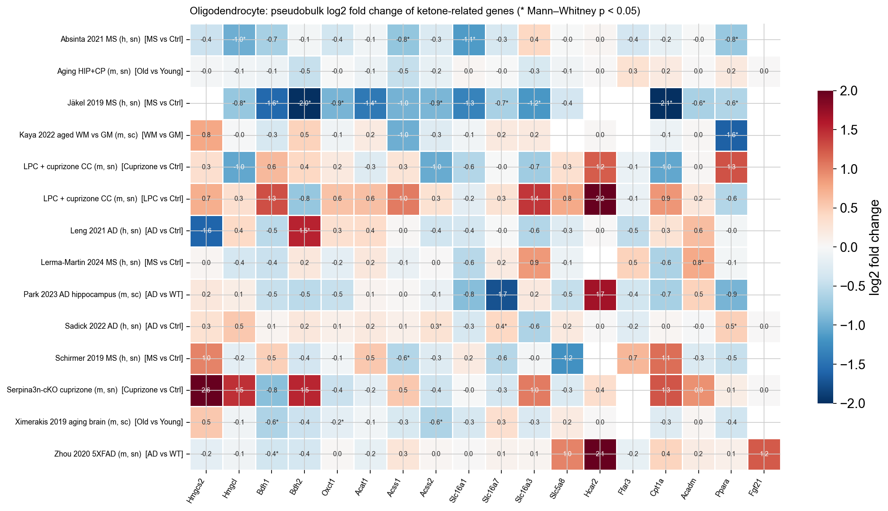
<figcaption>Public datasets, oligodendrocytes: pseudobulk log2 fold change of the ketone-related genes per contrast; * Mann–Whitney p < 0.05.</figcaption>
</figure>

<figure markdown="1">
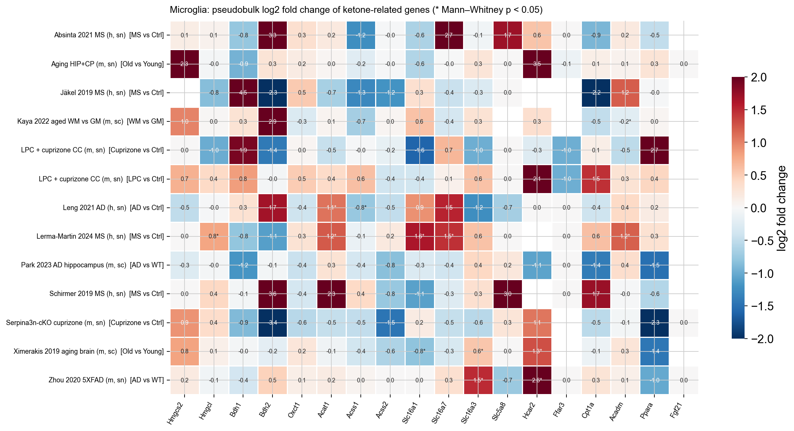
<figcaption>Public datasets, microglia: the same. *Hcar2* rises in nearly every disease contrast.</figcaption>
</figure>

## 6c. The central question: ketone handling in Xenium EAE with the genes the 5K panel carries

The panel has no committed ketone enzyme, so this rests on *Bdh1*, the MCT transporters, the BHB sensors and the β-oxidation chain in 107 samples and 27 cell types. Ketogenic competence (*Bdh1* + β-oxidation + PPARα / PGC1α) is astrocytic at baseline, and *Bdh1*⁺ cells of every type are enriched for β-oxidation genes, placing *Bdh1* on the ketogenic side. EAE does not induce this program: *Bdh1* falls toward lesions in every cell type, *Acss2*, *Ppargc1a* and *Ppara* fall broadly, and only oligodendrocytes gain a little *Bdh1*. What EAE turns on is monocarboxylate transport, MCT4 in 14 cell types and MCT1 in astrocytes, where it tracks lesion burden (ρ 0.68) and the RR disease course. Within a sample, DA oligodendrocytes have less *Bdh1*, MCT1 and β-oxidation than homeostatic ones and more MCT4, whereas newly formed oligodendrocytes have the most *Bdh1* and *Cpt1a* of the lineage. BHB sensing is myeloid: microglial *Hcar2* rises four-fold at onset and peak, *Hcar2*⁺ cells are *Nlrp3*⁺ *Cd36*⁺ phagocytes, and *Hcar2*⁺ / *Nlrp3*⁺ myeloid cells and MCT4⁺ astrocytes, not ketogenic astrocytes, are enriched around DA and *C4b*-high oligodendrocytes after lesion-distance matching. Local ketone production is therefore not up-regulated in EAE; if BHB helps, the route is exogenous supply and the cellular targets are the myeloid sensors and the MCT1-gaining glia.

<figure markdown="1">
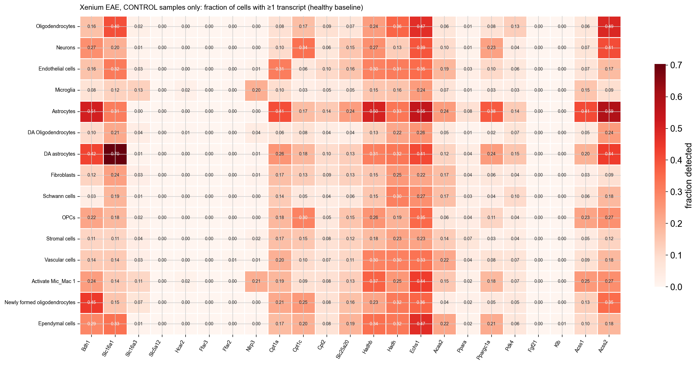
<figcaption>Xenium EAE, control samples: fraction of cells detecting each ketone-related gene on the 5K panel, by cell type.</figcaption>
</figure>

<figure markdown="1">
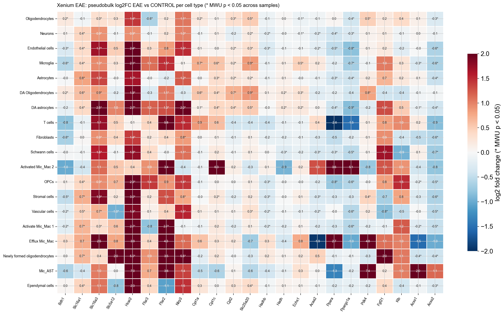
<figcaption>Xenium EAE: pseudobulk log2 fold change EAE vs CONTROL per cell type; * Mann–Whitney p < 0.05 across samples.</figcaption>
</figure>

<figure markdown="1">
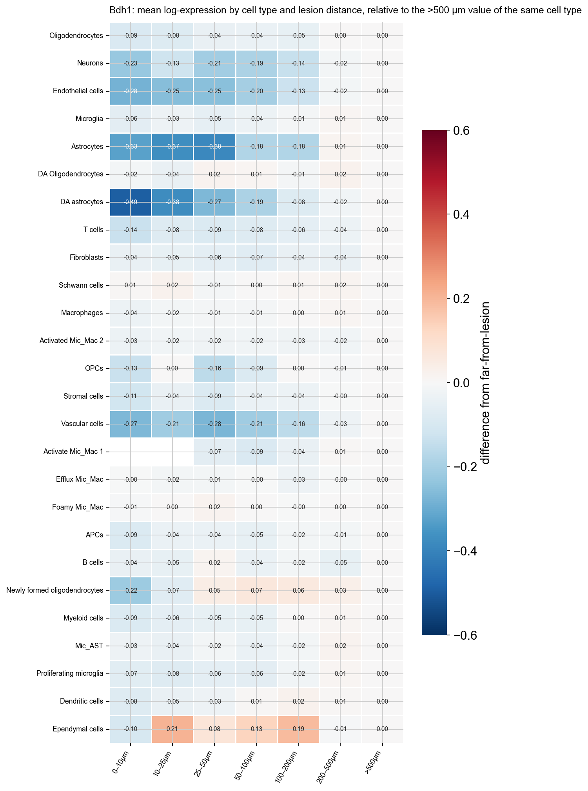
<figcaption>*Bdh1* by cell type and lesion distance, relative to each cell type's value beyond 500 µm.</figcaption>
</figure>

<figure markdown="1">
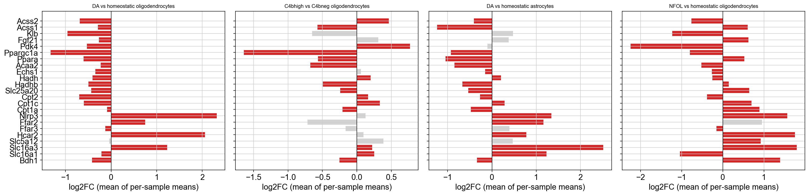
<figcaption>Paired within sample: DA vs homeostatic oligodendrocytes, *C4b*-high vs *C4b*-negative, DA vs homeostatic astrocytes, newly formed vs mature oligodendrocytes; red = Wilcoxon p < 0.05.</figcaption>
</figure>

<figure markdown="1">
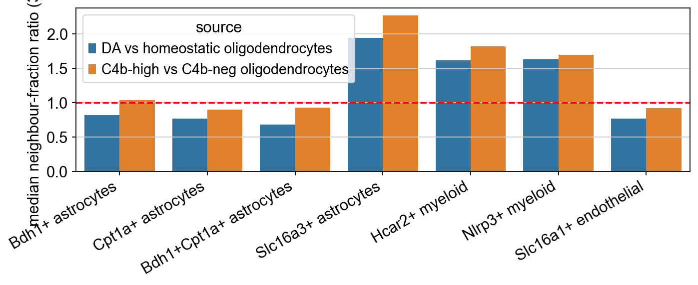
<figcaption>Neighbour-fraction ratios (30 µm) around DA vs homeostatic and *C4b*-high vs *C4b*-negative oligodendrocytes for ketogenic-competent astrocytes, MCT4⁺ astrocytes, *Hcar2*⁺ / *Nlrp3*⁺ myeloid cells and MCT1⁺ endothelium.</figcaption>
</figure>

## 6d. The myeloid populations

Control myeloid tissue is 60 % homeostatic microglia; EAE re-populates it in a fixed order (infiltrating cells, macrophages and proliferating microglia at onset; macrophages at peak I, efflux cells at peak II, foam cells at peak III; an LXR-type "Activated Mic_Mac 2" state in remission and chronic disease), with macrophages making up 29 % of myeloid cells at the lesion core. Each population has its own metabolism: macrophages are hypoxic-glycolytic lactate exporters, foam cells are the only fatty-acid-oxidising population on top of maximal lipid storage, Activated Mic_Mac 2 handles lipid through *Lpl* / *Abca1*, infiltrating cells are glycolytic sensors (*Hcar2*, *Nlrp3*, *Ffar2*), APCs alone synthesise cholesterol. None make ketone bodies (*Bdh1* ≤ 7 %, *Ppara* ≤ 2 %); they carry MCT4 and the BHB sensors. The *Hcar2*⁺ phenotype is one phenotype everywhere, *Cd36*⁺ *Tnf*⁺ *Ccl2*⁺ *Cst7*⁺ with homeostatic identity retained and *Gpnmb* / *Igf1* / *Ccr2* depleted; microglia entering a lesion lose *Hcar2* and gain *Plin2*, MCT4 and *Cpt1a*, and microglial *Hcar2* is an onset / first-peak signal. Around *C4b*-high oligodendrocytes, Activated Mic_Mac 2, APCs and homeostatic microglia are enriched (2–3×, lesion-matched) but foam and efflux cells are not.

<figure markdown="1">
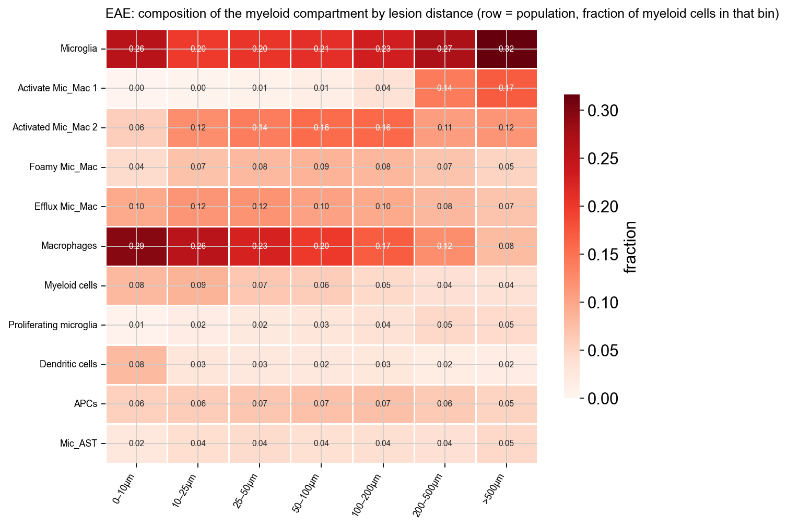
<figcaption>Composition of the myeloid compartment by lesion distance in EAE (fraction of myeloid cells in each bin).</figcaption>
</figure>

<figure markdown="1">
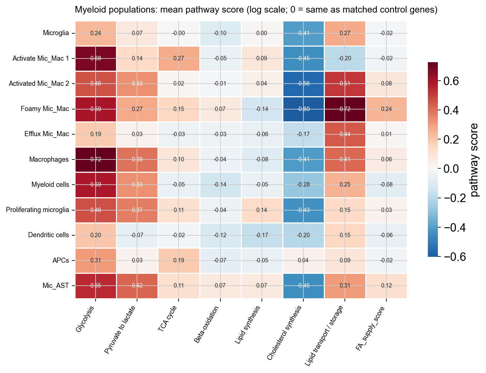
<figcaption>Mean pathway score per myeloid population.</figcaption>
</figure>

<figure markdown="1">
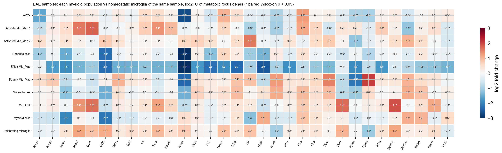
<figcaption>Each population versus homeostatic microglia of the same EAE sample: log2 fold change of the metabolic focus genes; * paired Wilcoxon p < 0.05.</figcaption>
</figure>

<figure markdown="1">
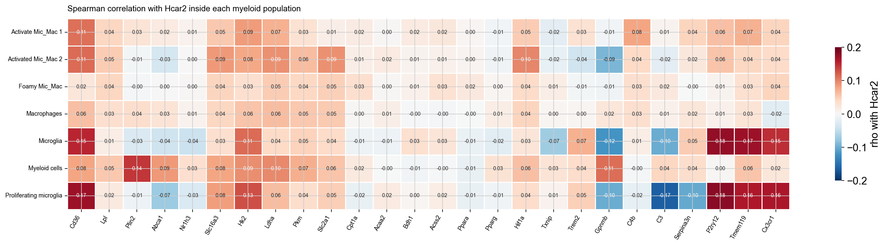
<figcaption>Spearman correlation with *Hcar2* inside each myeloid population.</figcaption>
</figure>

<figure markdown="1">
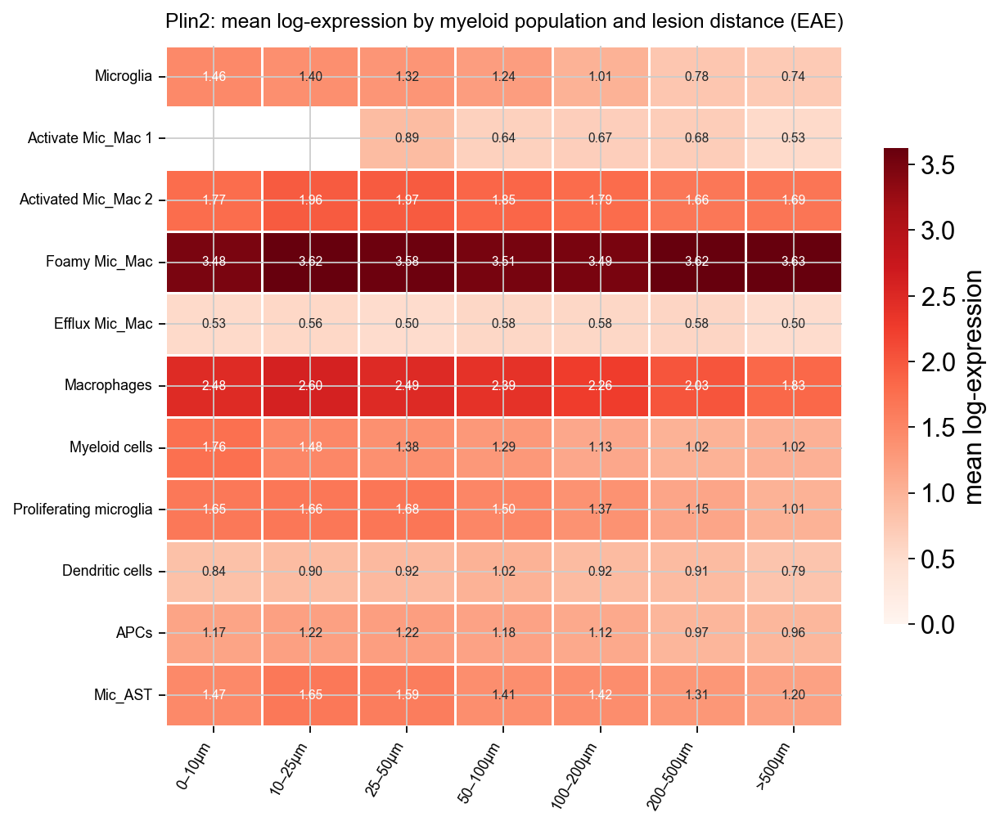
<figcaption>*Plin2* by myeloid population and lesion distance.</figcaption>
</figure>

<figure markdown="1">
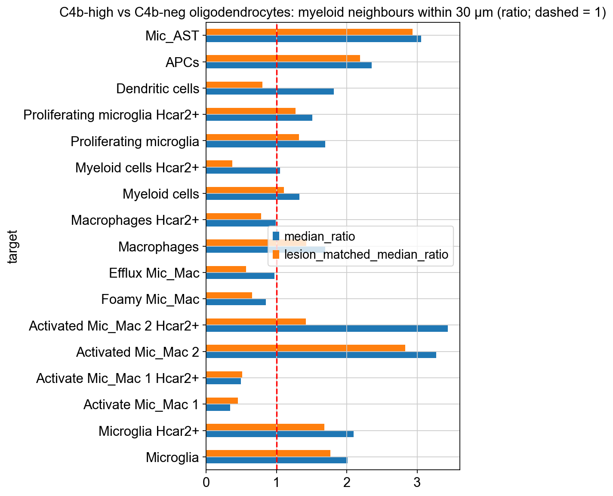
<figcaption>Myeloid populations within 30 µm of *C4b*-high versus *C4b*-negative oligodendrocytes (ratio, raw and lesion-distance-matched).</figcaption>
</figure>

## 7. Spatial partners of *C4b*-high oligodendrocytes (Xenium EAE)

*Hcar2*⁺ cells (median ratio 1.7), *Hcar2*⁺ myeloid cells (1.8), *Slc16a3*⁺ astrocytes (2.3), *Hk2*⁺ (1.8), *Pdk1*⁺ (1.3) and *Plin2*⁺ (1.4) cells are enriched within 30 µm of *C4b*-high compared with *C4b*-negative oligodendrocytes in 87 samples (paired Wilcoxon p < 10⁻⁵); *Slc2a1*⁺ cells are not. The enrichment survives matching for lesion distance (1.2–1.75) and restriction to non-lesion tissue (1.3–2.2).

<figure markdown="1">
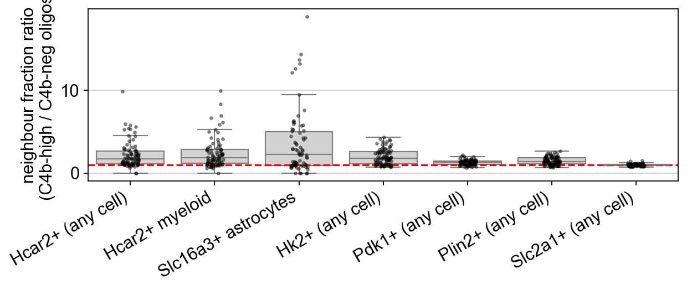
<figcaption>Per-sample ratio of the fraction of target-positive neighbours around *C4b*-high versus *C4b*-negative oligodendrocytes (30 µm).</figcaption>
</figure>

<figure markdown="1">
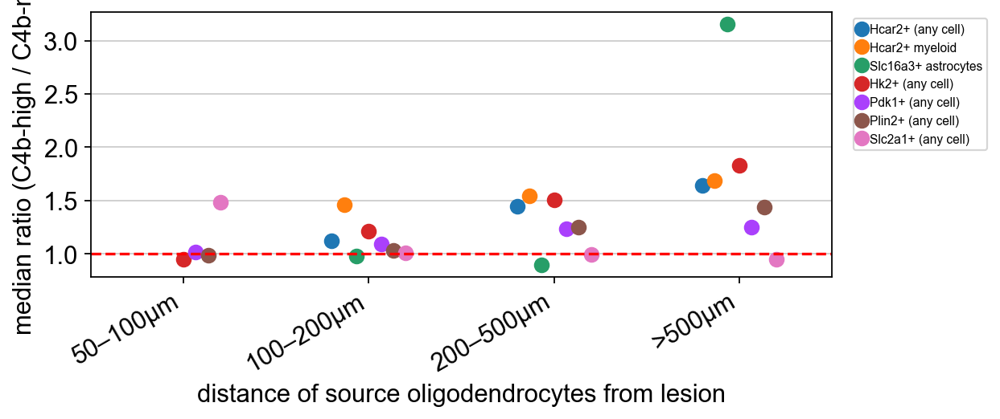
<figcaption>The same ratio after stratifying source oligodendrocytes by lesion distance.</figcaption>
</figure>

<figure markdown="1">
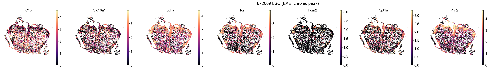
<figcaption>Xenium EAE, one peak-EAE sample: *C4b*, *Slc16a1*, *Ldha*, *Hk2*, *Hcar2*, *Cpt1a* and *Plin2*.</figcaption>
</figure>

## 8. Aging (Visium, 6 sections)

Whole-section glycolysis, TCA and OXPHOS scores rise slightly with age (p ≈ 0.03–0.04, slopes of a few hundredths over 15 months). In white-matter-rich spots the lipid-synthesis score falls, *Fa2h*, *Ugt8a*, *Cyp51* and *Hmgcs1* decline by 10–19 %, *Apoe* and *Plin2* rise and *Ddit4*, *Slc2a1* and *Sirt1* fall: a mild version of the EAE pattern.

<figure markdown="1">
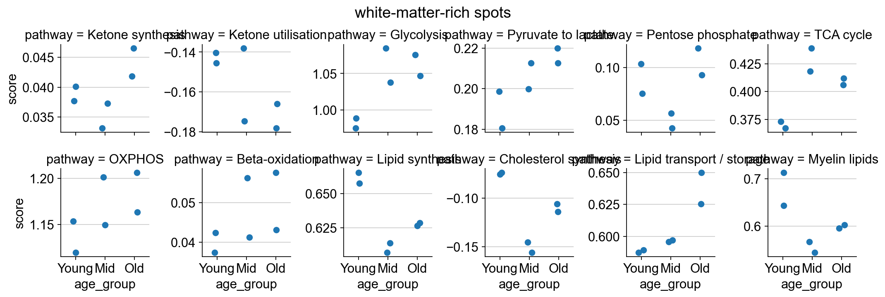
<figcaption>Visium aging, white-matter-rich spots: pathway score per section by age group.</figcaption>
</figure>

## 9. Caveats

1. Xenium AD has one section per genotype × age and only three metabolic genes.
2. The EAE 5K panel misses ketogenesis, ketolysis, most OXPHOS and most cholesterol-synthesis genes.
3. In situ transcripts inside a segment can come from a neighbouring cell (*Hcar2*, *Cd36*, *Slc16a3* in "oligodendrocytes"); the sorted Falcão cells are the control, and cells are the replicates there.
4. Pathway scores depend on set composition; compare by difference and check the gene tables.
5. Pseudobulk tests need ≥3 samples per group; Park, LPC / cuprizone, *Serpina3n*-cKO and several human contrasts fall short.
6. Nuclei detect cytoplasmic and mitochondrial metabolic transcripts far less than whole cells; microglial ambient RNA in demyelinating-lesion nuclei inflates *Apoe*, *Lpl* and *Hcar2* in "oligodendrocytes".
7. Human *C4B* is not quantifiable, so the *C4b* axis is mouse-only.

## 10. Suggested next steps

- Lipid-droplet staining (PLIN2 / PLIN4, BODIPY) and cholesterol-synthesis readouts (HMGCS1, SQLE) in *C4b*⁺ oligodendrocytes in EAE and aged white matter, the one metabolic feature that travels with the state in every dataset.
- MCT1 protein in DA oligodendrocytes and the lactate supply to axons near lesions (*Slc16a1* down, *Slc16a3*⁺ astrocytes and *Hcar2*⁺ myeloid cells enriched in the niche).
- Re-quantify human *C4A*/*C4B* (OligoC4b) so the *C4b* axis can be tested in the human MS sets where cholesterol synthesis moves the other way.
- Metabolic flux (Seahorse or ¹³C tracing) on sorted DA versus homeostatic oligodendrocytes to resolve the glycolysis / TCA direction that the two RNA read-outs disagree on.

## 11. Where everything lives

Repository `oligoMetab` (GitHub, `christoffermattssonlangseth/oligoMetab`): executed notebooks (spatial, public, ketone, EAE ketone, EAE myeloid) under `notebooks/analysis/`, sources under `notebooks/src/`, the gene panel and helpers in `scripts/oligometab.py`, summary tables in `results/`, and plain-language documentation in `docs/` (`metabolism_findings.md`, `gene_panel.md`, `notebooks.md`, `public_datasets.md`). Data are the OligoC4b objects on the group's analysis machine.
